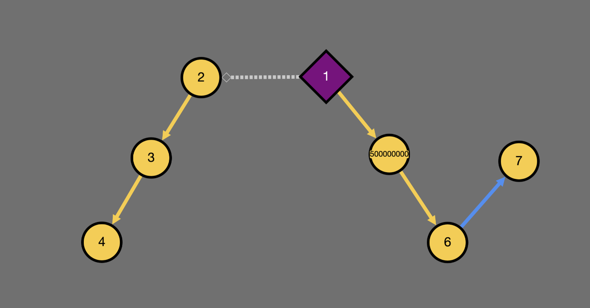
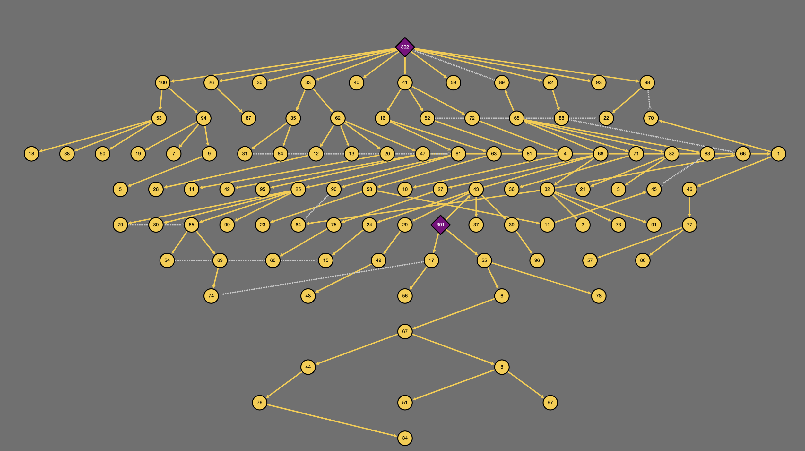
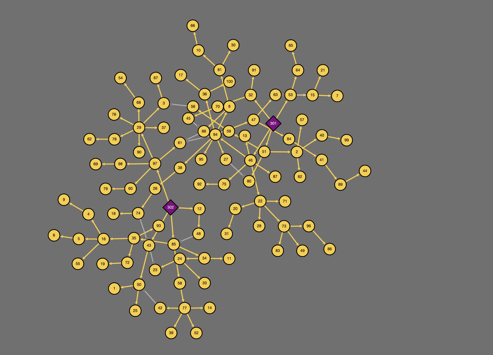

<!--
SPDX-FileCopyrightText: Contributors to the Power Grid Model project <powergridmodel@lfenergy.org>

SPDX-License-Identifier: MPL-2.0
-->

# Visualizer

## Features

- Based on [dash-cytoscape](https://github.com/plotly/dash-cytoscape).
- Visualize small and large (10000+ nodes) networks 
- Explore attributes of nodes and branches
- Highlight specific nodes and branches
- Visualize various layouts, including hierarchical, force-directed and coordinate-based layouts

With Coordinates    | Hierarchical | Force-Directed
:------------------:|:------------:|:-------------:
 |       |   

----- 
## Quickstart
#### Installation
```bash
pip install 'power-grid-model-ds[visualizer]'  # quotes added for zsh compatibility
```

#### Usage
```python
from power_grid_model_ds import Grid
from power_grid_model_ds.visualizer import visualize
from power_grid_model_ds.generators import RadialGridGenerator

grid = RadialGridGenerator(Grid).run()
visualize(grid)
```
This will start a local web server at http://localhost:8050

#### Disclaimer
Please note that the visualizer is still a work in progress and may not be fully functional or contain bugs.
We welcome any feedback or suggestions for improvement.
